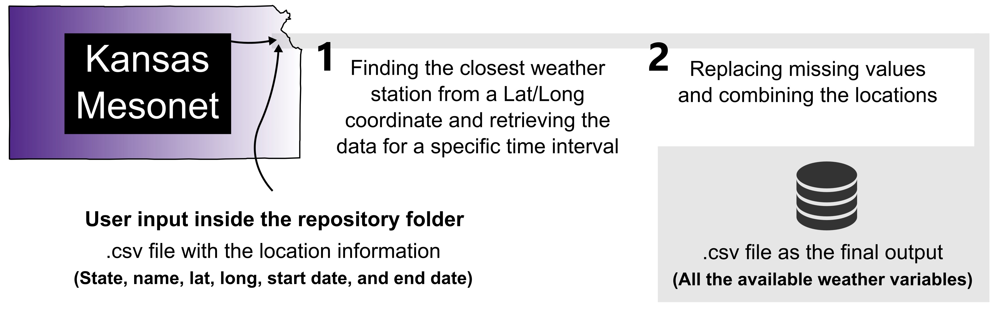

# KS_Weather
*Getting weather data with python 3*  

**Author**: Luiz Moro Rosso  
**Semester**: Spring 2019  
**Project area**: Agronomy

## Objective
Retrieving weather data from Kansas Mesonet for specific locations and time intervals.

## Outcomes
One .csv file with all the available [weather variables](http://mesonet.k-state.edu/rest/variables/) for specific Lat/Long coordinates and time intervals (from the crop planting to harvest, for example).

## Rationale
Exploring weather variables is primordial to understand plant-soil interactions and crop response to management practices, but data acquisition is time-consuming, and the output is pretty variable depending on the available sources. Also, weather stations occasionally experience issues with sensors and data recording, complicating further analysis.

The Kansas Mesonet has a [webpage](http://mesonet.k-state.edu/rest/) for providing land stations weather data across the entire state. However, even with a relatively easy interface, a python script to **download**, **clean**, and **organize** datasets would be helpful in research projects with many experimental locations or exploring many weather variables.

As the first step, the python code needs to get the user input (Table 1), identifying which is the closest weather station based on the Lat/Long coordinate. The variables will be downloaded in a *daily bases* from the start to the end date (period of interest). As soon as the data is imported and combined, a for loop will replace the missing values. The lines with "M" (missing) will be replaced with the value of the previous line, considering each column (all the weather variables).
  
**Table 1.** Example of `USER_inputs.csv` showing the required format for each column.

| State          | Location_code  | Latitude       | Longitude      | Start_date     |End_date        |
|:---------------|:---------------|:---------------|:---------------|:---------------|:---------------|
| Kansas         | Manhattan_01   | 00.0000000     | 00.0000000     | MM/DD/YYYY     | MM/DD/YYYY     |

## Sketch

        

## References
Kansas Mesonet, 2019: Kansas Mesonet Historical Data. Accessed 16 April 2019, http://mesonet.k-state.edu/weather/historical
